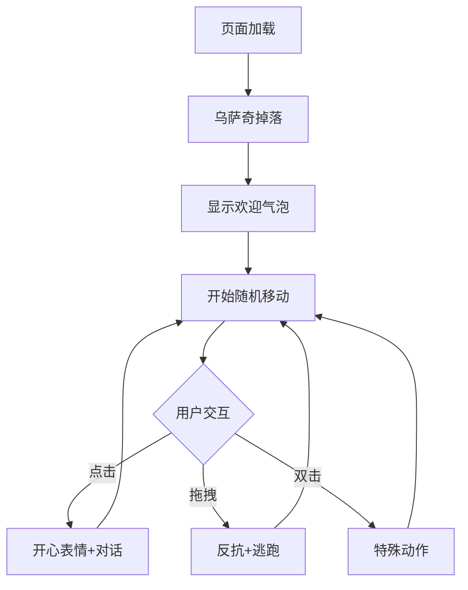
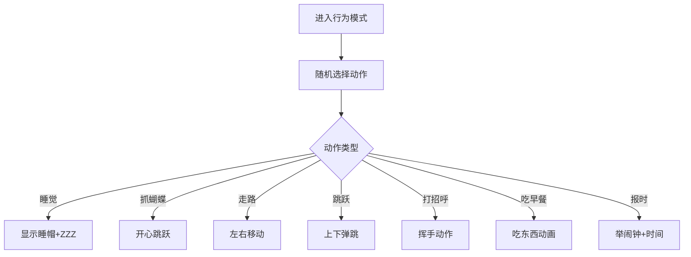

## 1. 产品概述
乌萨奇网页宠物是一个可爱的纯网页交互宠物应用，采用简约卡通风格的乌萨奇形象。用户打开网页后，乌萨奇从顶部掉落，支持多种交互行为，包括点击、拖拽、表情动作等。无需安装，即开即用，适合所有喜欢可爱桌面宠物的用户。

目标用户：喜欢可爱宠物、追求个性化网页体验的所有用户。

## 2. 核心功能

### 2.1 用户角色
| 角色 | 使用方式 | 核心权限 |
|------|----------|----------|
| 网页访客 | 直接访问网页 | 与乌萨奇互动、调整设置 |

### 2.2 功能模块
乌萨奇网页宠物包含以下核心功能：

1. **宠物显示**：80x80尺寸乌萨奇形象，简约卡通风渲染，网页背景
2. **掉落动画**：打开网页时乌萨奇从顶部自然掉落
3. **智能移动**：边缘检测、边界反弹、随机移动
4. **交互系统**：点击显示表情和对话；拖拽反抗与逃跑
5. **行为模式**：睡觉、抓蝴蝶、走路、跳跃、打招呼、吃早餐、报时
6. **设置面板**：除草证样式设置卡片，支持展开/收起
7. **对话气泡**：显示乌萨奇的对话内容和表情

### 2.3 页面详情
| 页面名称 | 模块名称 | 功能描述 |
|----------|----------|----------|
| 主页面 | 宠物显示区 | 显示乌萨奇形象，支持hover效果 |
| 主页面 | 掉落动画 | 页面加载时乌萨奇从顶部掉落至底部 |
| 主页面 | 智能移动 | 边界检测与反弹，随机移动模式 |
| 交互区 | 点击交互 | 点击触发开心表情和对话 |
| 交互区 | 拖拽交互 | 拖拽时显示反抗，松开后逃跑 |
| 设置面板 | 除草证卡片 | 可展开的设置选项面板 |
| 对话系统 | 气泡显示 | 显示乌萨奇对话和表情 |
| 行为系统 | 随机动作 | 定时触发各种可爱动作 |

## 3. 核心流程

### 主流程
1. 页面加载 → 乌萨奇从屏幕顶部掉落，显示欢迎对话
2. 边界检测 → 触碰边界时反弹，随机改变移动方向
3. 用户交互 → 点击触发开心表情；拖拽触发反抗和逃跑
4. 自动行为 → 定时触发睡觉、抓蝴蝶、走路等随机动作
5. 设置交互 → 点击设置按钮展开除草证样式设置面板

### 交互流程

### 行为模式流程

## 4. 用户界面设计

### 4.1 设计风格
- **形象风格**：简约卡通风格，80x80像素
- **主色调**：黄色系（乌萨奇主题色）
- **辅助色**：黑色、白色、浅灰色
- **背景**：简洁网页背景，支持响应式
- **按钮风格**：圆角矩形，简约卡通图标
- **字体**：易读中文与英文字体

### 4.2 页面设计
| 页面名称 | 模块名称 | UI元素 |
|----------|----------|--------|
| 主页面 | 宠物形象 | 80x80尺寸，黄色乌萨奇，简约卡通渲染 |
| 交互元素 | 设置按钮 | 除草证图标，悬浮显示 |
| 交互元素 | 动作按钮 | 简约图标，触发特殊动作 |
| 对话框 | 文本气泡 | 简约对话气泡，情绪色彩边框 |
| 设置面板 | 除草证样式 | 可展开收起的设置选项卡 |

### 4.3 响应式设计
- **移动优先**：支持手机、平板、桌面多种设备
- **自适应布局**：根据屏幕尺寸调整宠物大小和位置
- **触摸优化**：支持移动端触摸交互

## 5. 交互功能需求

### 5.1 鼠标交互
- **单击**：开心表情 + "乌拉～"
- **拖拽**：反抗表情，松开后快速移动到随机位置
- **双击**：触发特殊动作（跳跃、转圈等）
- **悬停**：显示互动提示

### 5.2 设置面板
- **展开/收起**：点击设置按钮切换面板状态
- **动作选择**：手动选择特定动作
- **速度调节**：调整移动速度
- **重置位置**：将乌萨奇重置到初始位置

### 5.3 自动行为
- **随机移动**：在屏幕内随机移动
- **边界反弹**：触碰边界时智能反弹
- **定时动作**：每30秒触发随机可爱动作
- **时间感知**：根据时间显示不同行为（如夜晚睡觉）

## 6. 技术实现要点

### 6.1 DOM结构设计
- 宠物容器：绝对定位，支持拖拽
- 动画层：CSS动画实现掉落和移动
- 交互层：事件监听处理点击和拖拽
- 对话层：气泡提示系统

### 6.2 状态管理
- 位置状态：记录当前坐标
- 移动状态：移动方向和速度
- 交互状态：点击、拖拽等行为状态
- 动画状态：当前播放的动画类型

### 6.3 边界检测
- 屏幕边界：检测与浏览器窗口边界的碰撞
- 反弹逻辑：碰撞后改变移动方向
- 边缘挂住：模拟桌面版的边缘挂住效果