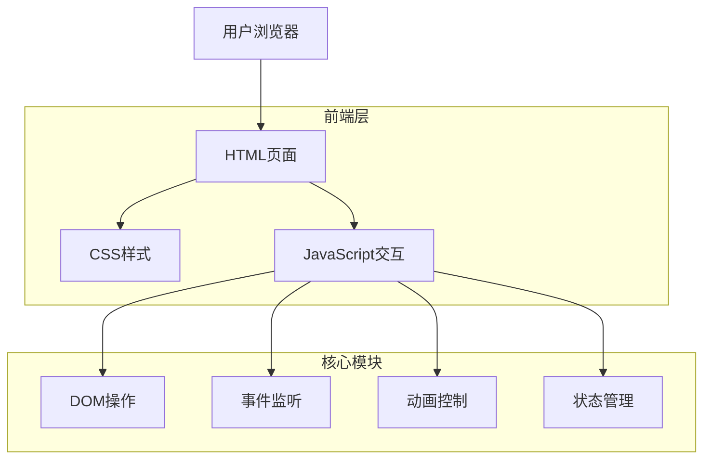
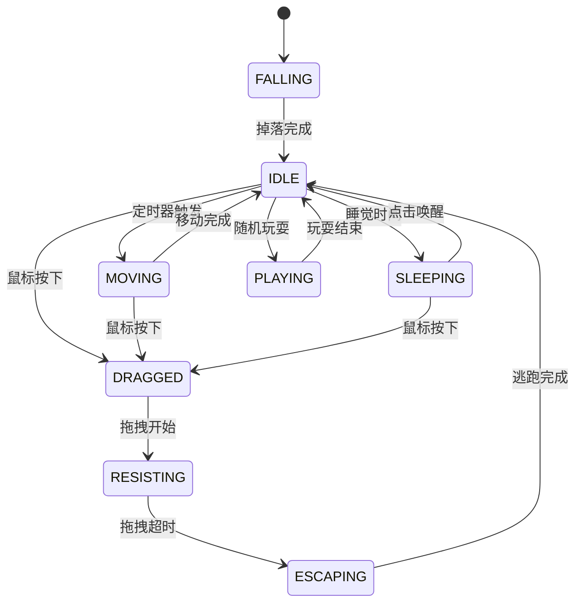

## 1. 架构设计



## 2. 技术描述

- 前端：HTML5 + CSS3 + JavaScript (ES6+)
- 动画：CSS Animation + JavaScript 动画控制
- 交互：原生DOM事件处理
- 初始化工具：无需构建工具，纯原生实现

## 3. DOM结构设计

### 3.1 核心DOM元素
```html
<div id="usagi-container">
    <div id="usagi-pet" class="usagi-sprite">
        <div class="usagi-body"></div>
        <div class="usagi-face"></div>
        <div class="usagi-accessories"></div>
    </div>
    <div id="usagi-bubble" class="speech-bubble">
        <span class="bubble-text"></span>
    </div>
    <div id="settings-card" class="settings-panel">
        <div class="settings-header">除草证</div>
        <div class="settings-content">
            <button class="action-btn" data-action="sleep">睡觉</button>
            <button class="action-btn" data-action="butterfly">抓蝴蝶</button>
            <button class="action-btn" data-action="walk">走路</button>
            <button class="action-btn" data-action="jump">跳跃</button>
            <button class="action-btn" data-action="reset">重置位置</button>
        </div>
    </div>
    <button id="settings-toggle" class="settings-btn">⚙️</button>
</div>
```

### 3.2 样式结构
```css
#usagi-container {
    position: fixed;
    top: 0;
    left: 0;
    width: 100vw;
    height: 100vh;
    pointer-events: none;
    z-index: 9999;
}

#usagi-pet {
    position: absolute;
    width: 80px;
    height: 80px;
    cursor: pointer;
    pointer-events: auto;
    transition: transform 0.3s ease;
}

.usagi-sprite {
    background: #FFD700;
    border-radius: 50%;
    display: flex;
    align-items: center;
    justify-content: center;
    font-size: 40px;
}

.speech-bubble {
    position: absolute;
    background: white;
    border: 2px solid #333;
    border-radius: 15px;
    padding: 8px 12px;
    max-width: 150px;
    box-shadow: 0 2px 8px rgba(0,0,0,0.1);
}

.settings-panel {
    position: fixed;
    bottom: 20px;
    right: 20px;
    background: white;
    border: 3px solid #8B4513;
    border-radius: 10px;
    padding: 15px;
    box-shadow: 0 4px 12px rgba(0,0,0,0.2);
    display: none;
}
```

## 4. 状态机设计

### 4.1 宠物状态机
```javascript
const PetState = {
    IDLE: 'idle',           // 静止状态
    MOVING: 'moving',       // 移动中
    FALLING: 'falling',     // 掉落中
    DRAGGED: 'dragged',     // 被拖拽
    RESISTING: 'resisting', // 反抗中
    ESCAPING: 'escaping',   // 逃跑中
    SLEEPING: 'sleeping',   // 睡觉中
    PLAYING: 'playing',     // 玩耍中
    EATING: 'eating'        // 吃东西
};

const PetBehavior = {
    WALK: 'walk',
    JUMP: 'jump',
    SLEEP: 'sleep',
    BUTTERFLY: 'butterfly',
    GREET: 'greet',
    EAT: 'eat',
    TIME: 'time'
};
```

### 4.2 状态转换规则


## 5. 移动与边界检测

### 5.1 边界检测算法
```javascript
class BoundaryDetector {
    constructor() {
        this.margin = 30;
        this.screenWidth = window.innerWidth;
        this.screenHeight = window.innerHeight;
    }

    checkBoundary(x, y, petSize) {
        const boundaries = {
            left: x <= this.margin,
            right: x >= this.screenWidth - petSize - this.margin,
            top: y <= this.margin,
            bottom: y >= this.screenHeight - petSize - this.margin
        };

        return {
            hit: Object.values(boundaries).some(b => b),
            boundaries,
            bounceDirection: this.calculateBounce(boundaries)
        };
    }

    calculateBounce(boundaries) {
        let dx = 1, dy = 1;
        if (boundaries.left || boundaries.right) dx = -dx;
        if (boundaries.top || boundaries.bottom) dy = -dy;
        return { dx, dy };
    }
}
```

### 5.2 掉落动画
```javascript
function startFallingAnimation() {
    const pet = document.getElementById('usagi-pet');
    const startY = -80;
    const endY = window.innerHeight - 80;
    
    pet.style.top = startY + 'px';
    pet.style.left = Math.random() * (window.innerWidth - 80) + 'px';
    
    const duration = 2000;
    const startTime = Date.now();
    
    function animate() {
        const elapsed = Date.now() - startTime;
        const progress = Math.min(elapsed / duration, 1);
        
        // 使用缓动函数
        const easeOut = 1 - Math.pow(1 - progress, 3);
        const currentY = startY + (endY - startY) * easeOut;
        
        pet.style.top = currentY + 'px';
        
        if (progress < 1) {
            requestAnimationFrame(animate);
        } else {
            showWelcomeMessage();
            startRandomMovement();
        }
    }
    
    animate();
}
```

## 6. 交互系统

### 6.1 点击交互
```javascript
class InteractionHandler {
    constructor(petElement) {
        this.pet = petElement;
        this.clickCount = 0;
        this.lastClickTime = 0;
        this.setupEventListeners();
    }

    setupEventListeners() {
        this.pet.addEventListener('click', (e) => this.handleClick(e));
        this.pet.addEventListener('mousedown', (e) => this.handleMouseDown(e));
        this.pet.addEventListener('dblclick', (e) => this.handleDoubleClick(e));
    }

    handleClick(e) {
        const currentTime = Date.now();
        
        if (currentTime - this.lastClickTime < 300) {
            return; // 双击不处理单击
        }
        
        this.lastClickTime = currentTime;
        this.clickCount++;
        
        // 显示开心表情
        this.showHappyExpression();
        
        // 显示对话
        this.showDialogue('乌拉～');
        
        // 触发小跳跃
        this.triggerJump();
    }

    handleDoubleClick(e) {
        this.showSpecialAction();
    }

    handleMouseDown(e) {
        if (this.isSleeping()) {
            this.wakeUp();
            this.showDialogue('哈？！');
        }
    }
}
```

### 6.2 拖拽交互
```javascript
class DragHandler {
    constructor(petElement) {
        this.pet = petElement;
        this.isDragging = false;
        this.dragStartTime = 0;
        this.dragResistanceTime = 10000; // 10秒后反抗
        this.startX = 0;
        this.startY = 0;
        this.setupDragEvents();
    }

    setupDragEvents() {
        this.pet.addEventListener('mousedown', (e) => this.startDrag(e));
        document.addEventListener('mousemove', (e) => this.drag(e));
        document.addEventListener('mouseup', (e) => this.endDrag(e));
    }

    startDrag(e) {
        this.isDragging = true;
        this.dragStartTime = Date.now();
        this.startX = e.clientX - this.pet.offsetLeft;
        this.startY = e.clientY - this.pet.offsetTop;
        
        // 显示反抗表情
        this.showResistExpression();
        
        // 设置拖拽超时
        this.dragTimeout = setTimeout(() => {
            this.triggerEscape();
        }, this.dragResistanceTime);
    }

    drag(e) {
        if (!this.isDragging) return;
        
        const x = e.clientX - this.startX;
        const y = e.clientY - this.startY;
        
        this.pet.style.left = x + 'px';
        this.pet.style.top = y + 'px';
        
        // 更新反抗表情强度
        const dragDuration = Date.now() - this.dragStartTime;
        this.updateResistIntensity(dragDuration);
    }

    endDrag(e) {
        if (!this.isDragging) return;
        
        this.isDragging = false;
        clearTimeout(this.dragTimeout);
        
        // 触发逃跑
        this.escapeToEdge();
    }
}
```

## 7. 设置卡片与气泡系统

### 7.1 设置卡片控制
```javascript
class SettingsCard {
    constructor() {
        this.card = document.getElementById('settings-card');
        this.toggleBtn = document.getElementById('settings-toggle');
        this.isVisible = false;
        this.setupControls();
    }

    setupControls() {
        this.toggleBtn.addEventListener('click', () => this.toggle());
        
        // 动作按钮事件
        const actionButtons = this.card.querySelectorAll('.action-btn');
        actionButtons.forEach(btn => {
            btn.addEventListener('click', (e) => {
                const action = e.target.dataset.action;
                this.triggerAction(action);
            });
        });
    }

    toggle() {
        this.isVisible = !this.isVisible;
        this.card.style.display = this.isVisible ? 'block' : 'none';
        
        if (this.isVisible) {
            this.showWelcomeMessage();
        }
    }

    showWelcomeMessage() {
        this.showBubble('我是设置', 5000);
    }

    triggerAction(action) {
        switch(action) {
            case 'sleep':
                this.pet.sleep();
                break;
            case 'butterfly':
                this.pet.catchButterfly();
                break;
            case 'walk':
                this.pet.startWalking();
                break;
            case 'jump':
                this.pet.jump();
                break;
            case 'reset':
                this.pet.resetPosition();
                break;
        }
        
        this.hide();
    }
}
```

### 7.2 气泡系统
```javascript
class BubbleSystem {
    constructor() {
        this.bubble = document.getElementById('usagi-bubble');
        this.bubbleText = this.bubble.querySelector('.bubble-text');
        this.activeTimeout = null;
    }

    show(text, duration = 3000) {
        // 清除之前的超时
        if (this.activeTimeout) {
            clearTimeout(this.activeTimeout);
        }
        
        // 设置文本
        this.bubbleText.textContent = text;
        
        // 定位气泡在宠物上方
        this.positionBubble();
        
        // 显示气泡
        this.bubble.style.display = 'block';
        this.bubble.style.opacity = '1';
        
        // 自动隐藏
        this.activeTimeout = setTimeout(() => {
            this.hide();
        }, duration);
    }

    positionBubble() {
        const pet = document.getElementById('usagi-pet');
        const petRect = pet.getBoundingClientRect();
        
        this.bubble.style.left = (petRect.left + petRect.width / 2 - 75) + 'px';
        this.bubble.style.top = (petRect.top - 60) + 'px';
    }

    hide() {
        this.bubble.style.opacity = '0';
        setTimeout(() => {
            this.bubble.style.display = 'none';
        }, 300);
    }
}
```

## 8. 随机行为系统

### 8.1 行为调度器
```javascript
class BehaviorScheduler {
    constructor(pet) {
        this.pet = pet;
        this.behaviors = [
            'sleep', 'butterfly', 'walk', 'jump', 
            'greet', 'eat', 'time'
        ];
        this.interval = 30000; // 30秒
        this.scheduleNext();
    }

    scheduleNext() {
        this.nextBehaviorTime = Date.now() + this.interval;
        this.timeout = setTimeout(() => {
            this.triggerRandomBehavior();
        }, this.interval);
    }

    triggerRandomBehavior() {
        const behavior = this.behaviors[
            Math.floor(Math.random() * this.behaviors.length)
        ];
        
        this.pet.performBehavior(behavior);
        this.scheduleNext();
    }

    checkTimeBasedBehaviors() {
        const hour = new Date().getHours();
        
        if (hour >= 22 || hour < 6) {
            this.pet.sleep();
        } else if (hour === 8) {
            this.pet.eatBreakfast();
        } else if (hour === 12) {
            this.pet.eatLunch();
        } else if (hour === 18) {
            this.pet.eatDinner();
        } else if (hour === 0) {
            this.pet.announceTime();
        }
    }
}
```

## 9. 初始化流程

### 9.1 页面加载流程
```javascript
class UsagiWebPet {
    constructor() {
        this.init();
    }

    async init() {
        // 1. 创建DOM结构
        this.createDOM();
        
        // 2. 初始化组件
        this.pet = new PetCharacter();
        this.interaction = new InteractionHandler(this.pet);
        this.drag = new DragHandler(this.pet);
        this.settings = new SettingsCard();
        this.bubble = new BubbleSystem();
        this.behavior = new BehaviorScheduler(this.pet);
        
        // 3. 启动掉落动画
        this.startFallingAnimation();
        
        // 4. 启动时间检查
        this.startTimeChecker();
        
        // 5. 显示欢迎消息
        setTimeout(() => {
            this.bubble.show('乌拉！我是乌萨奇！', 3000);
        }, 3000);
    }

    createDOM() {
        // 动态创建所有必要的DOM元素
        const container = document.createElement('div');
        container.id = 'usagi-container';
        container.innerHTML = `
            <div id="usagi-pet" class="usagi-sprite">🐰</div>
            <div id="usagi-bubble" class="speech-bubble">
                <span class="bubble-text"></span>
            </div>
            <div id="settings-card" class="settings-panel">
                <div class="settings-header">除草证</div>
                <div class="settings-content"></div>
            </div>
            <button id="settings-toggle" class="settings-btn">⚙️</button>
        `;
        
        document.body.appendChild(container);
    }
}

// 页面加载完成后初始化
document.addEventListener('DOMContentLoaded', () => {
    new UsagiWebPet();
});
```